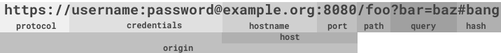

# URI

The URI class that parses and builds and URL.




## Interface

```typescript
interface URI {
  protocol                      // returns protocol
  username                      // returns username if exists otherwise false
  password                      // returns password if exists otherwise false
  hostname                      // returns hostname
  port                          // returns port if exists otherwise false
  host                          // returns host
  origin                        // returns origin
  path                          // returns path
  pathParts                     // returns path parts
  query                         // returns query
  queryParams                   // returns query as object
  hash                          // returns hash
  toString();                   // converts URI instance to string
  toObject();                   // converts URI instance to Object
}
```

## Examples

```javascript
import URI from 'uriil/URI';

const uri = URI.parse('https://example.com');
uri.toObject();

```
